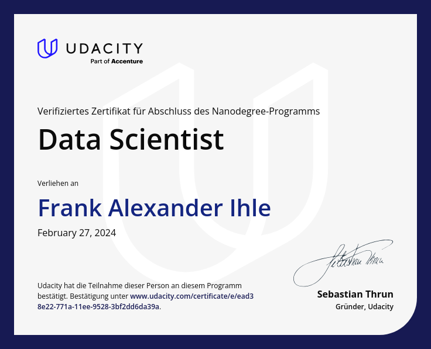

# Data Science Projects
This repo covers basic experiments around the topic of data science in order to get a better feeling of its capabilities and limitations.

In the subfolders different aspects are being evaluated and briefly introduced below

| Experiment   |     Description      |
|--------------|:--------------------:|
| sleep alone study | Extracting, upcycling and evaluating data from a publicly available dataset about sleeping behavior of participants: what drives people in relationships to sleep in separate beds. Given the sparse data, take the conclusion with a grain of salt. Main focus was the technical backend |
| disaster response handling | processing unstructured data in a [ETL](https://en.wikipedia.org/wiki/Extract,_transform,_load)-pipeline, preparing classifiers in a [ML](https://en.wikipedia.org/wiki/Machine_learning)-pipeline and run it all together in a local web app to run a support-recommendator for an emergency response operator, a kind of a spam-filter on a non E-Mail topic  |
| weather influence on music | A larger project, that combines the techniques from the projects above, it takes past weather data and combines it with the music people listened to at that time in order to estimate the right type of song relative to the current weather conditions |

Each individual sub program can be executed individually. 

## Side notes

For the sake of readbility and traceability the amount of code quality measures intentionally have been kept low

All content has been worked out during a Udacity Nano Degree training

